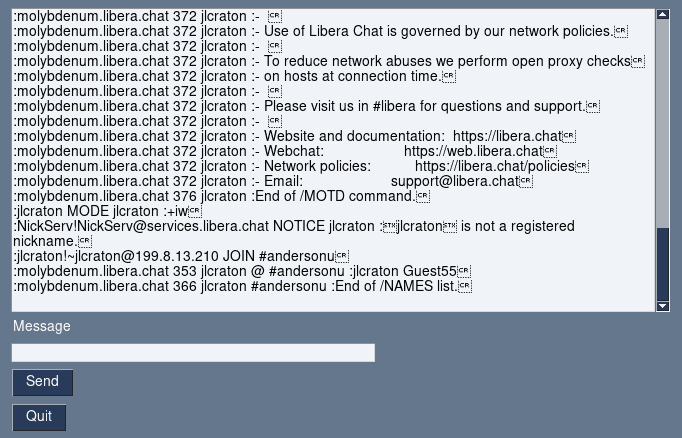

IRC Client
==========

This project implements a very basic [Internet Relay Chat (IRC)](https://en.wikipedia.org/wiki/Internet_Relay_Chat) client. It is missing some implementation details.

The original [IRC RFC 1459](https://www.rfc-editor.org/rfc/rfc1459) may be a helpful reference as you work to complete this application.

Once complete, this application should automatically connect to the "#andersonu" IRC channel on `irc.libera.chat`. You can also interact with this room via the [Libera web client](https://web.libera.chat/) to confirm that your program works as expected.

Dependencies
------------

This project depends on PySimpleGUI to create a graphical application. If you have `pip` installed properly and available in your path, you should be able to install PySimpleGUI by running:

```
pip3 install -r requirements.txt
```

Testing
-------

The functions lacking implementations include unit tests to verify that they are working correctly. These can be run using:

```
python3 -m doctest irc.py
```

Or if make is available:

```
make
```

Once all tests are passing, you should address the `TODO` comments in the `main` function. If these have been completed correctly, you should be able to run your program with the following command:

```
python3 irc.py
```

If your application is working correctly it should look like the following after a few moments:


